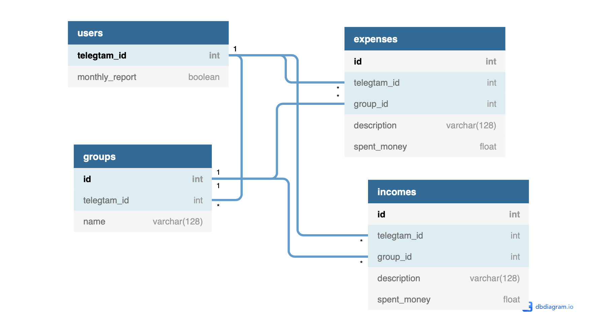

# Python Wallet Tracker Telegram bot

---

## Calculation of expenses and incomes
## I have tried many similar applications but they all are uncomfortable to use, so I created my own. You can create yours own categories of incomes and expenses. And  than to add names and costs of income/expense to these categories. Also you can put on display the current amount of expenses/incomes separately for each category and the total current amount of expenses/ incomes of all categories, by one command. Every 1st day of a new month, the bot sends a general report of expenses/incomes.

---
To install requirements run:

`pip install -r requirements.txt`

---

Copy file `example.env` into `.env` and replace `TOKEN` with your token from the Telegram

---

To run:

`python main.py`

---
Tables schema:

---
Telegram bot link

https://t.me/Pocket_manage_bot
